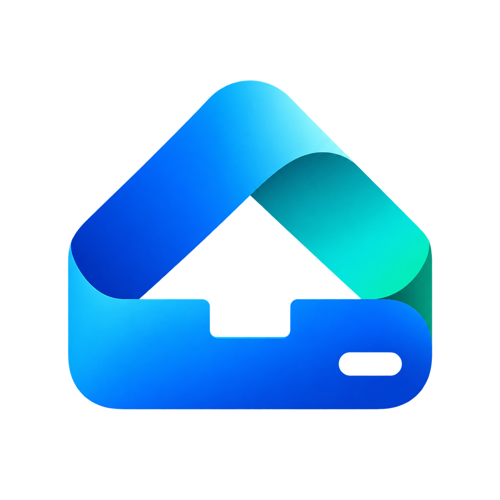
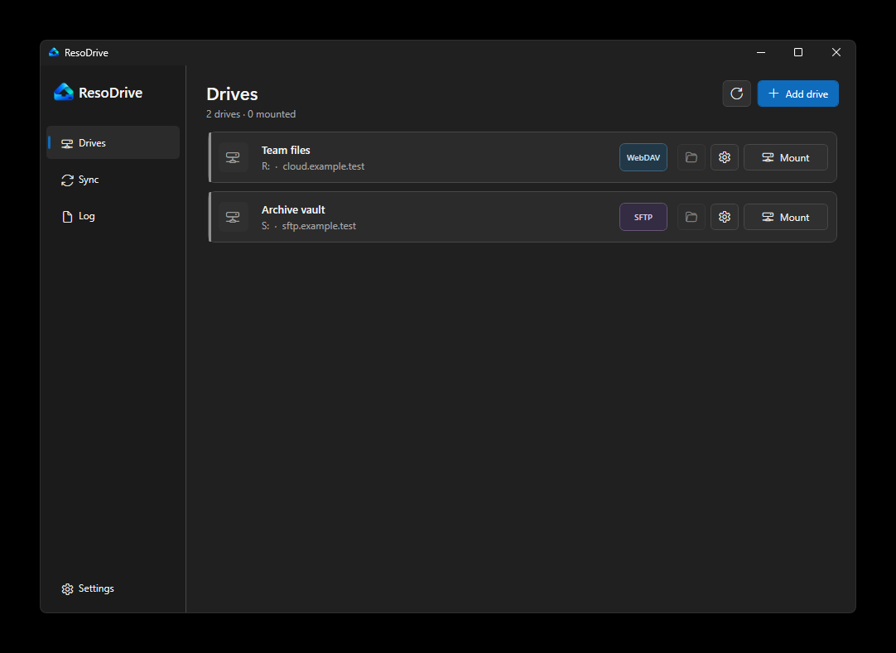
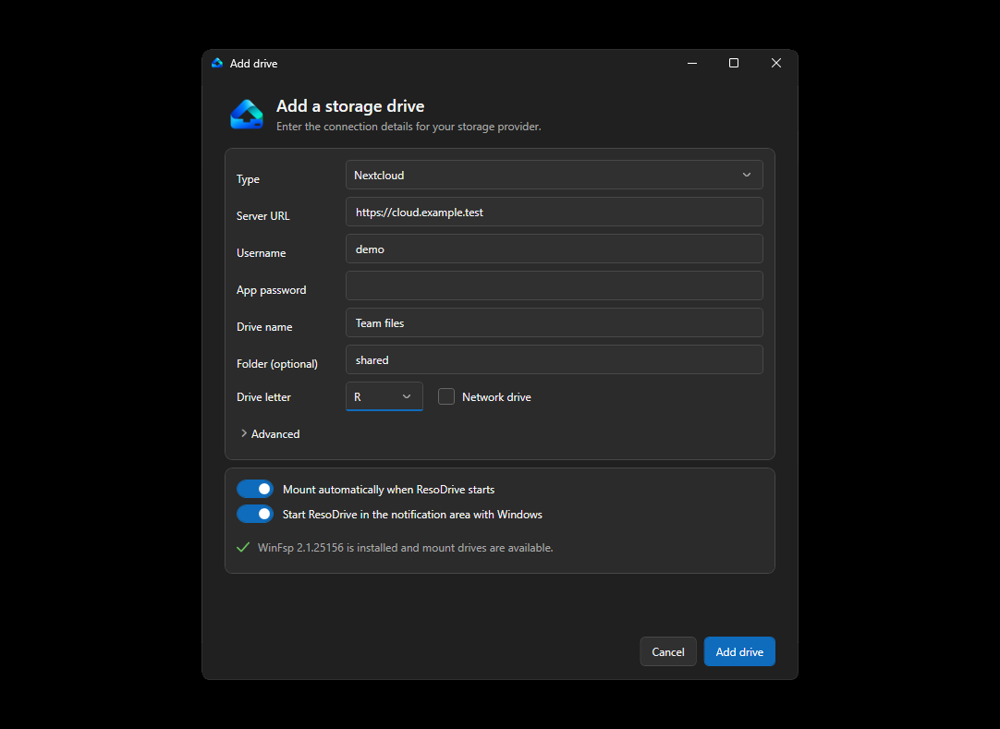
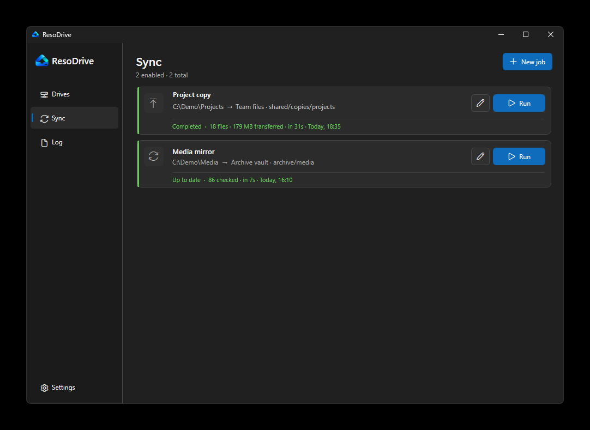
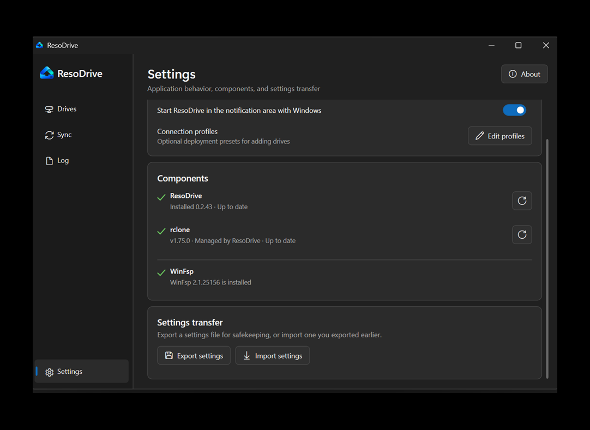
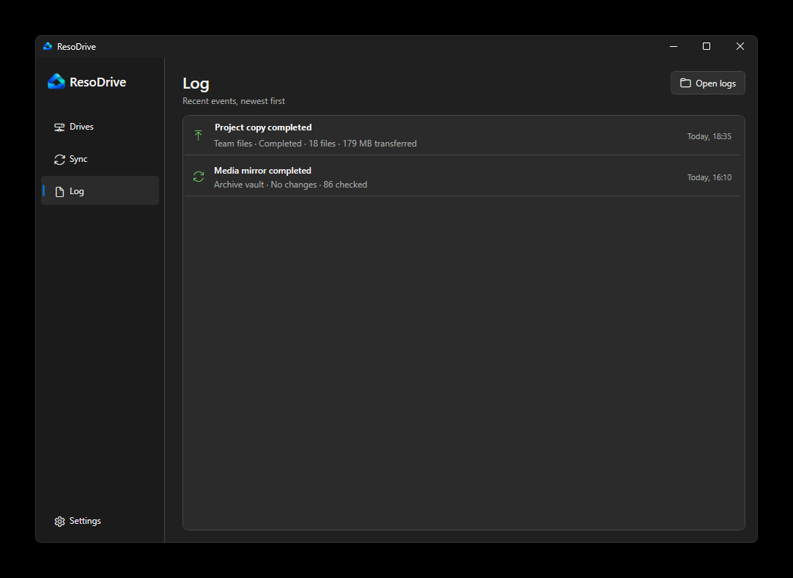

<p align="center">
  
</p>

<h1 align="center">ResoDrive</h1>

<p align="center">
  Mount Nextcloud, other WebDAV storage, and SFTP servers as drives in Windows.
</p>

<p align="center">
  <a href="https://github.com/alphasixtyfive/resodrive/releases/latest">Download</a>
  · <a href="https://github.com/alphasixtyfive/resodrive/issues">Report an issue</a>
  · <a href="CHANGELOG.md">Changelog</a>
</p>

<p align="center">
  <a href="https://github.com/alphasixtyfive/resodrive/actions/workflows/ci.yml"></a>
  <a href="LICENSE"></a>
</p>

ResoDrive is a small Windows tray app for storage that normally lives in a browser
or command line. Connect Nextcloud, WebDAV, or SFTP, choose a drive letter, and use
the storage from Explorer. Closing the window does not interrupt active mounts or
transfers.

## What it does

- Mount Nextcloud, WebDAV, and SFTP storage in Explorer.
- Use passwords or SFTP private keys without putting credentials in profiles.
- Choose which drives mount at sign-in and how they reconnect.
- Run one-way copy or mirror jobs with readable progress and recent results.
- Keep credentials encrypted for your Windows account and rclone isolated from any
  system installation.
- Recover from background interruptions and unreliable connections automatically.

## See it in action

<table>
  <tr>
    <td colspan="2">
      
      <br><strong>Drives at a glance</strong><br>Mount storage, open mounted locations, and reach each drive's settings from one place.
    </td>
  </tr>
  <tr>
    <td width="50%">
      
      <br><strong>Guided setup</strong><br>Add Nextcloud, WebDAV, or SFTP storage without hand-editing configuration files.
    </td>
    <td width="50%">
      
      <br><strong>Copy and mirror jobs</strong><br>See direction, completion details, transferred data, checks, and one-click controls.
    </td>
  </tr>
  <tr>
    <td width="50%">
      
      <br><strong>Components and settings</strong><br>Keep dependencies current, export your settings, or import a configuration you saved earlier.
    </td>
    <td width="50%">
      
      <br><strong>Readable activity</strong><br>Review recent mount and transfer results without digging through raw logs.
    </td>
  </tr>
</table>

All names, hosts, and paths shown above are fictional demonstration data.

It runs on 64-bit Windows 11 and [supported Windows 10 LTSC or Enterprise releases](https://learn.microsoft.com/dotnet/core/install/windows#supported-versions)
as old as version 1809. The setup program installs the .NET 10 Desktop Runtime
only when it is missing. Mounting a drive requires
[WinFsp](https://winfsp.dev/); copy and mirror jobs do not.

## Install

Download `ResoDrive-Setup.exe` from the latest
[release](https://github.com/alphasixtyfive/resodrive/releases/latest), run it,
and open ResoDrive. The first time through:

1. Let ResoDrive download and verify rclone.
2. Add your storage connection and choose a free drive letter.
3. If you want a mounted drive, install WinFsp when prompted.

Your settings, encrypted credentials, logs, cache, and managed rclone copy live in
`%LOCALAPPDATA%\rdrive`. An upgrade leaves that folder alone. After the first
install, you can check for and install ResoDrive updates from Settings.
Application and rclone downloads can continue from a partial file after a dropped
connection, which avoids starting large transfers again on metered or satellite links.

<details>
<summary><strong>Deployment profiles</strong></summary>

You do not need a profile file for personal use. ResoDrive opens with manual setup
when no `profiles.json` is present.

For a team deployment, start with [`profiles.sample.json`](profiles.sample.json),
add the connection presets you want to offer, and save the result as:

```text
%LOCALAPPDATA%\rdrive\profiles.json
```

Profiles are for connection details and defaults. Do not put passwords, tokens, or
private keys in them.

</details>

<details>
<summary><strong>Build from source</strong></summary>

Install the .NET 10 SDK, then run:

```powershell
dotnet test resodrive.slnx --configuration Release
.\build.ps1
```

The verified setup executable, MSI, and portable package are written to
`artifacts\win-x64`. The app is framework-dependent to keep downloads small; the
setup executable handles the runtime prerequisite for new installations.

</details>

## Project

- [Contributing](CONTRIBUTING.md)
- [Security](docs/SECURITY.md)
- [Architecture](docs/ARCHITECTURE.md)
- [Release process](docs/RELEASING.md)

ResoDrive is built by [@alphasixtyfive](https://github.com/alphasixtyfive) and
released under the [MIT license](LICENSE).
